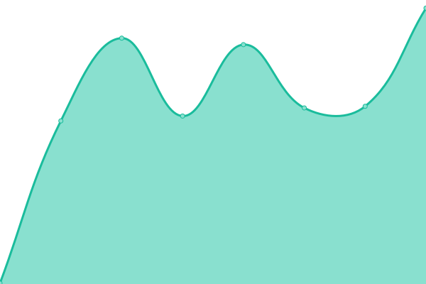
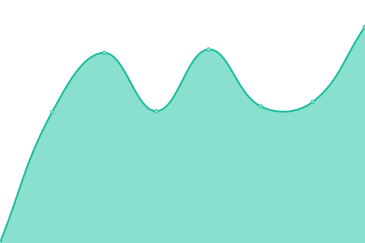

# [📈 Live Status](https://hannesWeb.github.io/uptimecheck): <!--live status--> **🟧 Partial outage**

This repository contains the open-source uptime monitor and status page for [Hannes Hirsch](http://hannes-hirsch.de), powered by [Upptime](https://github.com/upptime/upptime).

With [Upptime](https://upptime.js.org), you can get your own unlimited and free uptime monitor and status page, powered entirely by a GitHub repository. We use [Issues](https://github.com/hannesWeb/uptimecheck/issues) as incident reports, [Actions](https://github.com/hannesWeb/uptimecheck/actions) as uptime monitors, and [Pages](https://hannesWeb.github.io/uptimecheck) for the status page.

<!--start: status pages-->
<!-- This summary is generated by Upptime (https://github.com/upptime/upptime) -->
<!-- Do not edit this manually, your changes will be overwritten -->
<!-- prettier-ignore -->
| URL | Status | History | Response Time | Uptime |
| --- | ------ | ------- | ------------- | ------ |
|  [Main Webpage](https://www.hannes-hirsch.de) | 🟥 Down | [main-webpage.yml](https://github.com/hannesWeb/uptimecheck/commits/HEAD/history/main-webpage.yml) | 

 807ms
     
 | 

<a href="https://uptime.hannes-hirsch.de/history/main-webpage">93.53%</a>
    

|  [Fallback](http://www.hannes-hirsch.de) | 🟩 Up | [fallback.yml](https://github.com/hannesWeb/uptimecheck/commits/HEAD/history/fallback.yml) | 

 312ms
     
 | 

<a href="https://uptime.hannes-hirsch.de/history/fallback">100.00%</a>
    

|  [API](https://hannes-hirsch.de/api) | 🟨 Degraded | [api.yml](https://github.com/hannesWeb/uptimecheck/commits/HEAD/history/api.yml) | 

 497ms
     
 | 

<a href="https://uptime.hannes-hirsch.de/history/api">3.18%</a>
    

<!--end: status pages-->

[**Visit our status website →**](https://hannesWeb.github.io/uptimecheck)

## 📄 License

- Powered by: [Upptime](https://github.com/upptime/upptime)
- Code: [MIT](./LICENSE) © [Anand Chowdhary](https://anandchowdhary.com), supported by [Pabio](https://pabio.com)
- Data in the `./history` directory: [Open Database License](https://opendatacommons.org/licenses/odbl/1-0/)
